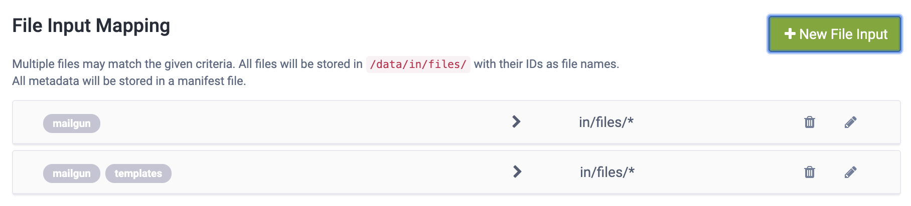
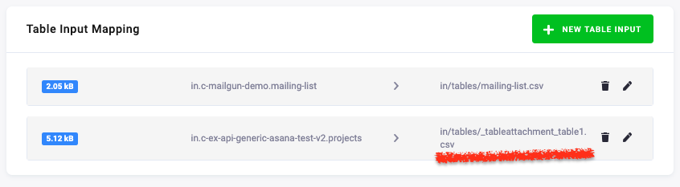

# Mailgun

Mailgun is an email automation service. It offers a complete cloud-based email service for sending, receiving and tracking email sent through your websites and applications. This component allows to connect Mailgun with Keboola platform, for sending automation.

To successfully operate the component, following parameters are required:

- a private API key for Mailgun,
- a Mailgun domain.

If you're unsure on where to find the API key, follow the steps mentioned in the [documentation](https://help.mailgun.com/hc/en-us/articles/203380100-Where-Can-I-Find-My-API-Key-and-SMTP-Credentials-) on how to obtain the API key. When it comes to Mailgun domains, upon registering each user is provisioned a sandbox domain. The sandbox domain can only send email to [**authorized recipients**](https://help.mailgun.com/hc/en-us/articles/217531258-Authorized-Recipients). The limit is 5 authorized recipients per sandbox domain. It is therefore highly recommended to [register your own domain with Mailgun](https://help.mailgun.com/hc/en-us/articles/202256730-How-do-I-pick-a-domain-name-for-my-Mailgun-account-) to not be limited by sandbox restrictions.

##### Pricing

Note that Mailgun is a paid service and is subject to [Mailgun's Terms Of Service](https://www.mailgun.com/terms/). By default, each domain can send up to 10 000 emails per month for free. For more information about pricing, please visit [Mailgun's pricing explorer](https://www.mailgun.com/pricing).

**Table of contents**

[TOC]

## Changes from previous version

With a new version of Mailgun component, there were some changes, which make this version non-backwards compatible and hence some effort is required to migrate. Major changes include:

1. A region can be specified in the configuration (see [Parameters](https://bitbucket.org/kds_consulting_team/kds-team.app-mailgun-v2/src/master/README.md#markdown-header-parameters))
2. Changed column names for input table and support of more Mailgun features (see [Mailing list](https://bitbucket.org/kds_consulting_team/kds-team.app-mailgun-v2/src/master/README.md#markdown-header-mailing-list))
3. Sending tabular attachments straight from Keboola storage (see [Table input mapping](https://bitbucket.org/kds_consulting_team/kds-team.app-mailgun-v2/src/master/README.md#markdown-header-table-input-mapping))
4. Improved specification of attachments and templates and automatic selection of latest available file (see [Path specification to template or file attachment](https://bitbucket.org/kds_consulting_team/kds-team.app-mailgun-v2/src/master/README.md#markdown-header-path-specification-to-template-or-file-attachment))
5. Subject, plain-text or html template are now customized using `{{COLUMN_NAME}}` tags, instead of `%(COLUMN_NAME)s` as before (see [Email customization](https://bitbucket.org/kds_consulting_team/kds-team.app-mailgun-v2/src/master/README.md#markdown-header-email-customization))

## Configuration

The configuration of the component is done via a set of parameters, an input table and optional files. This, and all of the functionalities of the component, will be covered in this section. The documentation will extensively use the provided [sample configuration](https://bitbucket.org/kds_consulting_team/kds-team.app-mailgun-v2/src/master/component_config/sample-config/) to showcase the behavior of the application and how to cover special cases.

### Parameters

The component takes a total of 5 parameters. Four of the parameters can be configured in the UI of Keboola, one is only configurable via API as its configuration is rather excess.

The four required parameters are:

- API Key 
    - **type:** required
    - **configuration name:** `#apiToken`
    - **description:** An API key used to authenticate all requests against Mailgun API. If invalid value is provided, the application fails. More information on how to obtain the API key can be found in the [documentation](https://help.mailgun.com/hc/en-us/articles/203380100-Where-Can-I-Find-My-API-Key-and-SMTP-Credentials-).
- Domain
    - **type:** required
    - **configuration name:** `domainName`
    - **description:** The name of the domain, which will be used for delivering emails. You can find a list of all your domain in the *Control Panel* under the *Domains* tab. For sandbox domains, the domain is in form `sandbox[uniqueId].mailgun.org`, e.g. `sandbox15d3020e03ca4f8db4895fca549a8b3a.mailgun.org`. If the provided domain is not associated with the API key, or the domain is not found, the application will fail.
- Region
    - **type:** required
    - **configuration name**: `domainRegion`
    - **default:** US
    - **description**: The region where the Mailgun account or domain is located. Available values are US (sending via [https://api.mailgun.net/](https://api.mailgun.net/)) or EU (sending via [https://api.eu.mailgun.net/](https://api.eu.mailgun.net/)). If incorrect region is specified, the application will fail due to domain not existing in the region.
- Sender Name
    - **type:** required
    - **configuration name:** `fromName`
    - **description:** The name which will be displayed as a sender of the messages from Mailgun. Can be left blank, in which case only the sender's email will be used as sender's identification.

An optional parameter, configurable only via API is:

- Sender Email
    - **type:** optional
    - **configuration name:** `fromEmail`
    - **description:** The local part of the email address used to send messages.
    - **default:** `postmaster`

### Mailing list

Mailing list is the input table of emails, with other specified parameters, to which the messages will be sent. Mailing list can be configured in the table input mapping section, or must be stored in `/data/in/tables/` folder, and must not contain `_tableattachment_` in the destination name, as that is reserved for tabular attachments. 

A combination of 3 columns is required and other columns could be used to specify the parameters of each message as well as customize the template.

The three mandatory columns are:

- `email`
    - **description:** A single email address or a comma-separated list of email addresses, to which a message will be sent. The column is mandatory, thus if the column is not provided, the application will fail.
    - **example:** `testy.mctesface@domain.com`; `sterling.archer@fx.com, mallory.archer@fx.com`
- `subject`
    - **description:** A mandatory column defining the subject of the message.
    - **example:** `Testing email`; `New job announcement`
- `html_file` or `text`
    - **description:** Column `html_file` defines the file name of the html template, which shall be used as the message body (see section **Customization and attachments**). Column `text` defines the plain text body of the message. Either of the columns or both can be provided. If both columns have a valid value, by default Mailgun API prioritizes the html content over plain text content. Both of the columns can be customized with additional parameters (more on that in section **Customization and attachments**).
    - **example:**
        - `template.html`; `questionnaire.html`
        - `A very warm welcome!`; `This is a sample message.`

In addition to three (four) mandatory columns, a set of optional columns can be provided to alter the behavior of the message. All of these columns have a blank default value. These columns are:

- `delivery_time`
    - **description:** A timestamp in **RFC 2822** format, i.e. format `Fri, 25 Oct 2019 19:00:00 +0200`. If undefined or left blank, the message will be delivered instantly. The email delivery can't be scheduled more than three days in advance by design of the API.
    - **Mailgun mapping:** `o:deliverytime`
    - **example:** `Fri, 25 Oct 2019 19:00:00 +0200`; `Fri, 25 Oct 2019 17:00:00 GMT`
    - **hints:**
        - in Snowflake, the RFC 2282 format can be achieved using format `DY, DD MON YYYY HH24:MI:SS TZHTZM`
        - in Python, the RFC 2282 format can be achieved using format `%a, %d %b %Y %H:%M:%S %z`
- `cc`
    - **description:** A single email address or a comma-separated list of email addresses, to which a copy of the email will be delivered.
    - **Mailgun mapping:** `cc`
    - **example:** same as `email`
- `bcc`
    - **description:** A single email address or a comma-separated list of email addresses, to which a blind copy of the email will be delivered.
    - **Mailgun mapping:** `bcc`
    - **example:** same as `email`
- `tags`
    - **description:** A single tag or a comma-separated list of tags, which will be attached to the image. Tags are very useful for tracking specific emails or campaigns. Up to 3 tags can be applied to a single message; if more than 3 are provided, only the first three in the list will be applied, by design of the API.
    - **Mailgun mapping:** `o:tag`
    - **example:** `abc`; `abc, 123, 567`
- `attachments`
    - **description:** A single file name or a comma-separated list of filenames, which will attached to a message. See section **Sending attachments** for more information on how to correctly specify attachments.
    - **Mailgun mapping:** `attachments`
    - **example:** `__tableattachment__data.csv`; `graph.png, 123456789_data.json`
- `custom_fields`
    - **description:** All other custom fields and headers which should be added to a message. Must be a valid JSON object. If the object passed is not a valid object, email sending is not halted. See [documentation](https://documentation.mailgun.com/en/latest/api-sending.html#sending) for all available options.
    - **example:** `{"h:Reply-To": "reply_email@keboola.com"}`

Besides all of the columns mentioned above, it is possible to specify additional columns which will be used to customize either the html template, or the plain text body of the message. In fact, any of the columns can be used for message body customization. More about customization is covered in **Customizing messages**.

### File input mapping

Non-tabular files, such as html files, images, json, etc. can be used as attachments, or in case of html files as templates. In Keboola, all of these files must be properly mapped in *File input mapping* section, specifying the correct tags.



All of the files are automatically stored in `/data/in/files/` folder.

### Table input mapping

All tabular files from Keboola storage can be specified directly from Keboola's UI in the table input mapping section and must have a prefix `_tableattachment_`, otherwise they will be used as a mailing list; table without `_tableattachment_` prefix is not recognized as an attachment.



All of the tables are automatically stored in `/data/in/tables/` folder.

## Customization and attachments

The Mailgun component is able to handle some forms of customizations for each email. Along with sending attachments from file and table storage, the component is able to send a customized html template for each email. **All templates must be stored in file storage (see section *File Input Mapping*) and attachments can be stored either in file storage, or if applicable in standard table storage.**

In this section, a customization of templates as well as specifying attachments will be discussed. But firstly, let's start with how the component chooses files based on specification.

### Path specification to template or file attachment

In the previous version of Mailgun, a template or file attachment (further referred to as a file) had to be specified by it's full name only. Mailgun component could not perform any kind of search for patterns in names (glob search). This, of course, poised a problem when sending files from Keboola storage, since each filename is preceeded by its identificator, which is unknown to the user prior to uploading the file. For files, which are static and only uploaded once (e.g. templates), this might not be a problem. However, for files which are generated each day and then sent via Mailgun, this poised a problem. Often, a structure of files, similar to the one below, was created in Keboola file storage and users needed an extra transformation to determine the latest file's name.

```
445515655_report.pdf    321312312_template.html
446461182_report.pdf    760989809_template.html
446461232_report.pdf    944598324_template.html
451982978_report.pdf    131242341_logo.jpeg
478942334_report.pdf    542342123_graph.png
563242313_report.pdf    857923432_graph.png
589321233_report.pdf    878080998_graph.png
591233212_report.pdf    975763234_graph.png
623421321_report.pdf    653423674_report.pdf
```

With a new version of Mailgun, users are offered a much improved experience of file specification. Files (both html templates and files used for attachments) can be specified using a "simple" file name, without the identificator and Mailgun application will automatically choose the latest file based on available metadata.

For example, a following table with template and attachments can be specified.

| html_file               | attachments|
|-------------------------|------------|
| template.html           | report.pdf |
| 321312312_template.html | logo.jpeg  |

In the first row, the component first matches all files using glob, with a pattern of `*template.html`, which would in this case result in 3 files. Afterwards, the latest file is determined by using metadata (manifests) resulting in final file `944598324_template.html`, which will be used as a template. In case of attachments, identicall process is performed.

If you need to match a specific file precisely, you can do so by specifying its full name as is the case in the second row. Template `321312312_template.html` is one of the files present in the "environment" and is therefore used directly.

### Email customization

Each email body can be specified either by a plain text (using column `text`) or by an html template (using column `html_file`). Mailgun component allows further customizations of the body (both plain text and html) and subject using special word tags. These word tags take a form of `{{COLUMN_NAME}}`, where `COLUMN_NAME` is a name of the column, with which value the tag should be replaced. 

As an example, imagine, that a following input table is provided:

| email                | subject                          | text                                                                             | name  | order_id |
|----------------------|----------------------------------|----------------------------------------------------------------------------------|-------|----------|
| testy@mctestface.com | Your order summary #{{order_id}} | Hello {{name}},   Summary of your order: Order ID: {{order_id}} Email: {{email}} | Testy | 12345678 |

The component would read the contents of the plain text specified, and iterate over each column and replace the column tag `{{}}`, with its column value. In this case, an email would be sent with a following form:

```
To: testy@mctestface.com
Subject: Your order summary #12345678

Body:
Hello Testy,

Summary of your order:
Order ID: 12345678
Email: testy@mctestface.com
```

Note, that any of the attributes in the mailing list table can be used to fill subject, plain-text body, or html-template body. In case, a tag specified in the body of the email is not present in the input table, it will not be replaced. As an example, let's have a following html file `greetings.html`:

```html
<p>
    <strong>
        Hello {{name}},<br>
    </strong>
</p>
<p>
    Here's your order {{order_id}} of product {{product}}, it will arrive soon.
</p>
```

and following input table:

| email                | subject                          | html_file      | name  | order_id |
|----------------------|----------------------------------|----------------|-------|----------|
| testy@mctestface.com | Your order summary #{{order_id}} | greetings.html | Testy | 12345678 |

Together, they will generate an email with the following form:

```
To: testy@mctestface.com
Subject: Your order summary #12345678

Body:
Hello Testy,

Here's your order 12345678 of product {{product}}, it will arrive soon.
```

### Sending attachments

Mailgun component allows to send attachments both, from storage and file storage. Note, that total size of email **must no exceed 25MB**, otherwise it will not be accepted by the API and will be returned. Component performs a strict check for size prior to sending and all over-size emails are recorded in results table.

As discussed in previous sections, tabular attachments must have a suffix `_tableattachment_` and must be specified by their full name in the mailing list table. If multiple attachments are specified, their names must be separated by a comma. A combination of both tabular and file attachments is allowed, as long as they do not exceed 25MB.

Examples of attachments specification include:

```
_tableattachment_table1.csv, graph.png, report.pdf
131242341_logo.jpeg, _tableattachment_orders.csv
```

## Output

Mailgun component is configured in such a way, that any error in sending a message does not result in failure of the component. Instead, two tables are outputted; one with successfully sent messages and the second one with errors. Both are loaded into storage incrementally.

The `messages` table contains following columns:

- `id`
    - **description:** A unique identificator of a sent message, generated by Mailgun.
    - **example:** `20200201132125.1.74AAB19741F2684B@sandbox15d3020e03ca4f8db4895fca549a8b3a.mailgun.org`
- `timestamp`
    - **description:** A UNIX timestamp in miliseconds of the event, when message was accepted by Mailgun.
    - **example:** `1580563285000`
- `specification`
    - **description:** A JSON representation of the email, that was sent. Contains mainly information from the input table.
    - **example:** `{"email":"testy@mctestface.com"}`
- `html_file_used`
    - **description:** A path to file, which was used as a template for the email message.
    - **example:** `/data/in/files/544794840_demo_mail.html`
- `attachments_sent`
    - **description:** A list of files, that were sent as an attachment.
    - **example:** `["/data/in/files/544793857_chart.png", "/data/in/tables/_tableattachment_table1.csv"]`

The `errors` table contains following columns:

- `request_id`
    - **description:** A unique identification of the email attempt.
- `timestamp`
    - **description:** A UNIX timestamp in miliseconds of the event, when message was accepted by Mailgun.
    - **example:** `1580563285000`
- `specification`
    - **description:** A JSON representation of the email, that was sent. Contains mainly information from the input table.
    - **example:** `{"email":"testy@mctestface.com"}`
- `error`
    - **description:** Type of error.
    - **possible values:**
        - `TEMPLATE_NOT_FOUND_ERROR` - Specified template was not found.
        - `INVALID_TEMPLATE_ERROR` - Template was found, but it's not an .html file
        - `ATTACHMENT_NOT_FOUND_ERROR` - Specified attachment was not found in files or tables.
        - `EMAIL_TOO_LARGE_ERROR` - Email exceeds allowed 25MB.
        - `SEND_ERROR` - Email was sent to Mailgun, but the API returned an error.
- `error_message`
    - **description:** An error message accompanying `error` with further details.

## Development
 
This example contains runnable container with simple unittest. For local testing it is useful to include `data` folder in the root
and use docker-compose commands to run the container or execute tests. 

If required, change local data folder (the `CUSTOM_FOLDER` placeholder) path to your custom path:
```yaml
    volumes:
      - ./:/code
      - ./CUSTOM_FOLDER:/data
```

Clone this repository, init the workspace and run the component with following command:

```
git clone https://bitbucket.org:kds_consulting_team/kds-team.ex-ms-sharepoint.git my-new-component
cd my-new-component
docker-compose build
docker-compose run --rm dev
```

Run the test suite and lint check using this command:

```
docker-compose run --rm test
```