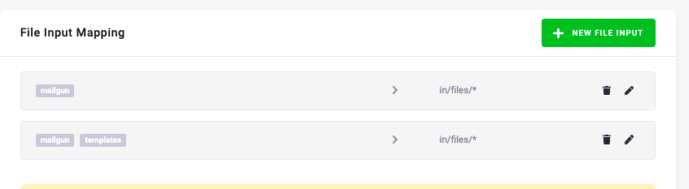

# Mailgun

Mailgun is an email automation service. It offers a complete cloud-based email service for sending, receiving and tracking email sent through your websites and applications. This component allows to connect Mailgun with Keboola platform, for sending automation.

To successfully operate the component, following parameters are required:

- a private API key for Mailgun,
- a Mailgun domain.

If you're unsure on where to find the API key, follow the steps mentioned in the [documentation](https://help.mailgun.com/hc/en-us/articles/203380100-Where-Can-I-Find-My-API-Key-and-SMTP-Credentials-) on how to obtain the API key. When it comes to Mailgun domains, upon registering each user is provisioned a sandbox domain. The sandbox domain can only send email to [**authorized recipients**](https://help.mailgun.com/hc/en-us/articles/217531258-Authorized-Recipients). The limit is 5 authorized recipients per sandbox domain. It is therefore highly recommended to [register your own domain with Mailgun](https://help.mailgun.com/hc/en-us/articles/202256730-How-do-I-pick-a-domain-name-for-my-Mailgun-account-) to not be limited by sandbox restrictions.

##### Pricing

Note that Mailgun is a paid service and is subject to [Mailgun's Terms Of Service](https://www.mailgun.com/terms/). By default, each domain can send up to 10 000 emails per month for free. For more information about pricing, please visit [Mailgun's pricing explorer](https://www.mailgun.com/pricing).

**Table of contents**

[TOC]

## Configuration

The configuration of the component is done via a set of parameters, an input table and optional files. This, and all of the functionalities of the component, will be covered in this section. The documentation will extensively use the provided [sample configuration](https://bitbucket.org/kds_consulting_team/kds-team.app-mailgun-v2/src/master/component_config/sample-config/) to showcase the behavior of the application and how to cover special cases.

### Parameters

The component takes a total of 5 parameters. Four of the parameters can be configured in the UI of Keboola, one is only configurable via API as its configuration is rather excess.

The four required parameters are:

- API Key 
  - **type:** required
  - **configuration name:** `#apiToken`
  - **description:** An API key used to authenticate all requests against Mailgun API. If invalid value is provided, the application fails. More information on how to obtain the API key can be found in the [documentation](https://help.mailgun.com/hc/en-us/articles/203380100-Where-Can-I-Find-My-API-Key-and-SMTP-Credentials-).
- Domain
  - **type:** required
  - **configuration name:** `domainName`
  - **description:** The name of the domain, which will be used for delivering emails. You can find a list of all your domain in the *Control Panel* under the *Domains* tab. For sandbox domains, the domain is in form `sandbox[uniqueId].mailgun.org`, e.g. `sandbox15d3020e03ca4f8db4895fca549a8b3a.mailgun.org`. If the provided domain is not associated with the API key, or the domain is not found, the application will fail.
- Region
  - **type:** required
  - **configuration name**: `domainRegion`
  - **default:** US
  - **description**: The region where the Mailgun account or domain is located. Available values are US (sending via [https://api.mailgun.net/](https://api.mailgun.net/)) or EU (sending via [https://api.eu.mailgun.net/](https://api.eu.mailgun.net/)). If incorrect region is specified, the application will fail due to domain not existing in the region.
- Sender Name
  - **type:** required
  - **configuration name:** `fromName`
  - **description:** The name which will be displayed as a sender of the messages from Mailgun. Can be left blank, in which case only the sender's email will be used as sender's identification.

An optional parameter, configurable only via API is:

- Sender Email
  - **type:** optional
  - **configuration name:** `fromEmail`
  - **description:** The local part of the email address used to send messages.
  - **default:** `postmaster`

### Mailing list

Mailing list is the input table of emails, with other specified parameters, to which the messages will be sent. A combination of 3 columns is required and other columns could be used to specify the parameters of each message as well as customize the template.

The three mandatory columns are:
- `email`
  - **description:** A single email address or a comma-separated list of email addresses, to which a message will be sent. The column is mandatory, thus if the column is not provided, the application will fail.
  - **example:** `testy.mctesface@domain.com`; `sterling.archer@fx.com, mallory.archer@fx.com`
- `subject`
  - **description:** A mandatory column defining the subject of the message.
  - **example:** `Testing email`; `New job announcement`
- `html_file` or `text`
  - **description:** Column `html_file` defines the file name of the html template, which shall be used as the message body. Column `text` defines the plain text body of the message. Either of the columns or both can be provided. If both columns have a valid value, by default Mailgun API prioritizes the html content over plain text content. Both of the columns can be customized with additional parameters (more on that in section **Customizing messages**.)
  - **example:**
    - `template.html`; `questionnaire.html`
    - `A very warm welcome!`; `This is a sample message.`

In addition to three (four) mandatory columns, a set of optional columns can be provided to alter the behavior of the message. All of these columns have a blank default value. These columns are:

- `delivery_time`
  - **description:** A timestamp in **RFC 2822** format, i.e. format `Fri, 25 Oct 2019 19:00:00 +02:00`. If undefined or left blank, the message will be delivered instantly. The email delivery can't be scheduled more than three days in advance by design of the API.
  - **Mailgun mapping:** `o:deliverytime`
  - **example:** `Fri, 25 Oct 2019 19:00:00 +02:00`; `Fri, 25 Oct 2019 17:00:00 GMT`
  - **hints:**
    - in Snowflake, the RFC 2282 format can be achieved using format `DY, DD MON YYYY HH24:MI:SS TZHTZM`
    - in Python, the RFC 2282 format can be achieved using format `%a, %d %b %Y %H:%M:%S %z`
- `cc`
  - **description:** A single email address or a comma-separated list of email addresses, to which a copy of the email will be delivered.
  - **Mailgun mapping:** `cc`
  - **example:** same as `email`
- `bcc`
  - **description:** A single email address or a comma-separated list of email addresses, to which a blind copy of the email will be delivered.
  - **Mailgun mapping:** `bcc`
  - **example:** same as `email`
- `tags`
  - **description:** A single tag or a comma-separated list of tags, which will be attached to the image. Tags are very useful for tracking specific emails or campaigns. Up to 3 tags can be applied to a single message; if more than 3 are provided, only the first three in the list will be applied, by design of the API.
  - **Mailgun mapping:** `o:tag`
  - **example:** `abc`; `abc, 123, 567`
- `attachments`
  - **description:** A single file name or a comma-separated list of filenames, which will attached to a message. See section **Sending attachments** for more information on how to correctly specify attachments.
  - **Mailgun mapping:** `attachments`
  - **example:** `__tableattachment__data.csv`; `graph.png, 123456789_data.json`

Besides all of the columns mentioned above, it is possible to specify additional columns which will be used to customize either the html template, or the plain text body of the message. In fact, any of the columns can be used for message body customization. More about customization is covered in **Customizing messages**.

### File Input Mapping

Non-tabular files, such as html files, images, json, etc. can be used as attachments, or in case of html files as templates. In Keboola, all of these files must be properly mapped in *File input mapping* section, specifying the correct tags.

All of the files are automatically copied to `/data/in/files/` folder.

### Output

After each successful run of the component, two tables are outputted. The tables are:

- `messages`
  - **description:** A table with all sent messages via the Mailgun API. Contains all the attachments which were mapped and sent, as well as the template which was sent and uset. A complete specification of the message is provided. For each sent message, a unique ID is generated by Mailgun's API and saved in this table.
  - **load type:** incremental
- `errors`
  - **description:** A table with all unsent messages and reasons for why these were aborted. If an error is encountered when sending any message, the error is recorded in this table and the process continues.
  - **load type:** full

